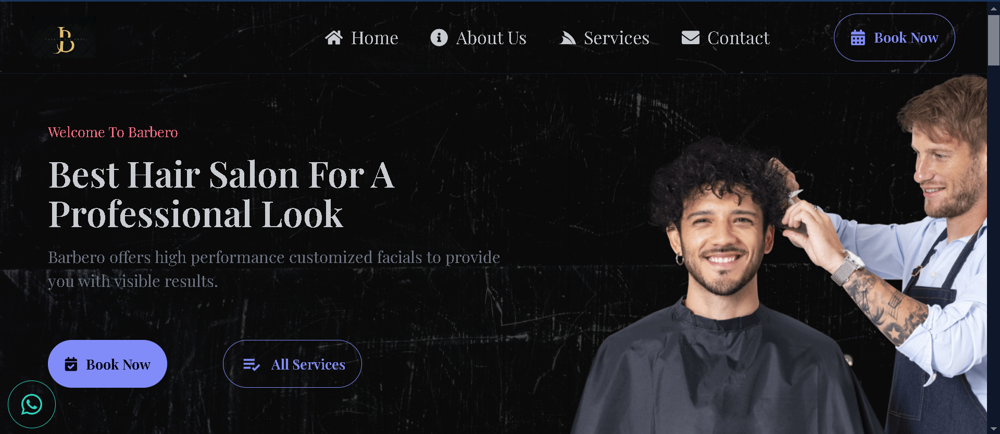

# Barber App - Barbero

An elegant, responsive Barber Shop website built with React, featuring a sleek landing page and interactive components for an enhanced user experience.

## Project Overview

This app is designed as a visually engaging landing page for **Barbero**, a premium barber shop. It showcases the services, client testimonials, working hours, and contact information. The site encourages customers to book appointments online and provides all necessary details to make the process seamless and professional.

### Technologies Used

- **React**: A JavaScript library for building user interfaces.
- **React Icons**: Used for adding icons in the application.
- **Tailwind CSS**: A utility-first CSS framework for styling.
- **DaisyUI**: A plugin for Tailwind CSS that provides pre-designed components.

### Key Features

1. **Landing Page**:

   - **Logo and Tagline**: Welcomes users with the shop's logo and tagline for a professional appeal.
   - **Introduction**: Brief overview of Barbero' services, emphasizing quality and professionalism.

2. **About Us Section**:

   - Describes Barbero as a **Premium Haircut & Grooming Salon** dedicated to providing a top-notch experience for men.

3. **Booking & Discounts**:

   - Allows users to **Book Appointments Online** and offers a **10% discount** on the first haircut booked through the website.

4. **Contact Information**:

   - Provides essential contact details such as:
     - **Phone Number**: +212664897030
     - **Email**: bilalbeny735@gmail.com
     - **Address**: 123 Main Street, City, ZIP Code, Country

5. **Working Days & Hours**:

   - Lists open days and hours:
     - **Monday to Friday**: 9 AM to 10 PM

6. **Testimonials**:

   - Showcases client feedback to build trust and showcase quality services.
   - Includes positive reviews from satisfied customers, highlighting aspects like ambiance, professionalism, and attention to detail.

7. **Popular Services**:

   - **Facial Hair Trim**: Expert facial hair grooming for a refined look, designed to complement each client's face shape.

8. **Footer**:
   - **Get In Touch** section for quick access to location, phone, and email.
   - **Social Media Icons**: Linked to platforms like Facebook and Instagram for extended online presence.
   - Copyright notice indicating all rights reserved to Barbero.

## Installation & Setup

1. Clone the repository:
   ```bash
   git clone https://github.com/Bilalben23/barber_loading_page.git
   cd barber_loading_page
   ```

### Visit the Site

- If you want to visit the site, you can find it [here](https://barber-loading-page.vercel.app/).
  

## Copyright

- 2024 All Copyrights Reserved To Barbero
